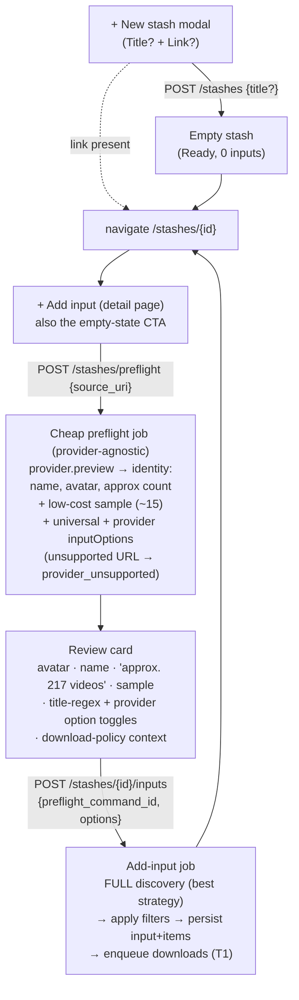

# Phase 6 Slice 6 — Refinement, correctness bugs & multi-input reframe

## Context

Slices 1–5 shipped the read/drill-down UI plus a single-shot Create Stash wizard, Settings,
and broadcast creation against an already-complete backend. Slice 6 fixes three verified
correctness bugs that break the core loop, and reframes stash creation around the spec's
multi-input model with a cleaner create/commit spine.

**The three load-bearing bugs (verified against source):**
1. **Downloads never fire.** `CreateStashFromDiscovery::commit()` creates the stash/items and
   returns; nothing enqueues `item.download`. `DownloadPolicyEvaluator::allowsAutomaticDownload()`
   exists and is correct but is only called in tests.
2. **Wrong-channel discovery.** `YouTubeChannelIdResolver::resolve()` takes the *first*
   `"channelId"` in the handle-page HTML — often a featured/recommended channel, not the owner —
   so the RSS feed is built for the wrong channel.
3. **Placeholder stash name.** `ResolvedInput.title` for a channel handle is the literal
   `"YouTube @{handle}"`; the real channel name/avatar are never captured.

### Confirmed decisions (Hazel)
- **No first-party special cases — 100% dogfood the public API.** The browser extension and the
  web UI use the *same* endpoints. `stash.create_from_preflight` is retired; there is one create
  model: `POST /stashes` (empty) + `POST /stashes/{id}/inputs` (add input).
- **Two workflows, one pipeline.** "Paste a link and go" and "start empty, fill gradually" are
  the same machinery with different entry points — *not* mutually exclusive once stash-creation
  and input-adding are separate operations.
- **Preflight is fast confirmation, not full enumeration.** Pasting a source resolves identity
  (name + avatar + approx. count) cheaply so the user can confirm it's what they expect. This is a
  **provider-agnostic contract** (a `Provider` capability) with **provider-specific
  implementations** — YouTube parses the channel page (which shows "217 videos"); another provider
  resolves it however it can. Full enumeration happens at **commit**.
- **Unsupported sources are handled gracefully.** If no provider supports the pasted URL
  (`ProviderRegistry::resolveForUri` throws today), return a stable `provider_unsupported` error and
  show a friendly "this source isn't supported yet — request it" message linking to open an issue.
- **Filters live on inputs, in two tiers.** (1) **Universal filters** apply to every input
  regardless of provider — at minimum a **title regex** include/exclude. (2) **Provider-specific
  options** (YouTube Shorts/live; Twitch has neither) come from the provider. Both are per-input
  because a stash can mix providers. `download_policy` stays per-stash; no inheritance in v1.
- **Downloads enqueue only after an input is persisted** (we can't download what isn't committed).
  Empty stashes download nothing.
- Slug duplicates get a filesystem-style ordinal **starting at 1** (`foo`, `foo-1`, `foo-2`, …),
  never an error.
- YouTube API key stored via `SecretsService`, `YOUTUBE_DATA_API_KEY` env kept as fallback.
- **Broadcast/policy mismatch: warn-and-prompt with a policy picker, never block.** When a stash's
  `download_policy` can't satisfy a broadcast's needs — `metadata_only` → *any* media broadcast, or
  `audio_only` → a *video* broadcast — prompt the user, explain, and let them pick a compatible
  policy inline (via T4 PATCH). Warn, don't block.
- **Multi-input → broadcast season mapping** is broadcast config, not stash/input config — it lives
  in `BroadcastRecord.settingsJson`. The multi-input work must keep input ids stable/referenceable
  so a broadcast can map input → season.
- Deferred infra (OpenAPI, incremental SSE, `canRegenerate`/`safeToDelete`) is in scope (6F).

## Execution environment
Backend runs in a **custom-FPM lerd site**. Per AGENTS.md, never run host `php`/`composer`/
`vendor/bin` — use the **lerd MCP `exec` tool** (`action: composer` for scripts, `action: console`
for Tempest console, `action: vendor_run` for pest/pint after `vendor_bins`). Frontend: `npm run
build` then redeploy assets + restart the worker (confirm the exact deploy step against existing
repo scripts before first deploy).

---

## The create/commit spine (architectural core — read first)

Today, creation is one atomic command (`stash.create_from_preflight`) that does preflight-replay +
stash + input + items in a single shot, always creating a *new* stash. We split it into separate,
composable operations so both workflows fall out of one pipeline:

- **Preflight stays stash-agnostic** (resolves a URL); commit targets a specific stash id. The same
  preflight→review→commit runs for the modal's first link *and* every later "+ Add input".
- **Paste-and-go** = blank title + link → stash named from resolved identity, one review click with
  sensible defaults. **Empty-and-fill** = title only → land on detail with the "+ Add input" empty
  state. Identical code path.
- **`download_policy` is a stash setting** (set in modal advanced / editable via T4 PATCH), shown in
  the review card as context ("Will download: video") so paste-and-go users aren't surprised, but it
  does not block.

---

## 6A — Correctness & data-integrity bugs (ship first)

### T1 · Auto-download eligible items at end of input commit
Enqueue belongs at the **end of `CreateStashFromDiscovery`'s input-commit** (after `stash_items`
exist, where we know what to download and the stash's policy is known) — never at stash creation.
- Collect `mediaItemId`s of newly-created stash items (the `findByStashAndMediaItem(...) === null`
  branch) that are **not** filtered-out (`state !== ignored`).
- If `DownloadPolicyEvaluator::allowsAutomaticDownload($stash->downloadPolicy)`, enqueue one
  download each by reusing the command path: inject `CommandDispatchService` and
  `dispatch(CommandType::ItemDownload, ['mediaItemId' => …, 'stashId' => …])` (runs
  `ItemDownloadCommandHandler::validate()` + `createJobs()`, one `JobIntent::Download`, priority 50).
  No parallel download path; respect the serial worker + idempotency.
- `metadata_only`/`manual_download` → enqueue nothing.
- **Acceptance:** fake-provider stash, `video` policy → downloads run automatically, Vault assets
  reach `ready`, no manual command. Empty stash / metadata-only → nothing enqueued.

### T2 · Cheap identity resolution: owner id + name + avatar + approx count (consolidates wrong-channel + name + avatar + count)
The generic contract is provider-agnostic (see the provider-`preview` capability in T9); this task
implements it for YouTube and threads the identity fields through. **Keep YouTube specifics behind
the provider boundary — nothing here may leak `UC…`/`channelId`/handle concepts into the generic
preflight, `ResolvedInput`, or stash layers.** The new `ResolvedInput` fields are generic
("source title / avatar / estimated count"), not YouTube-named.
- Make `YouTubeChannelIdResolver` return a value object (`ResolvedYouTubeChannel { id, title,
  avatarUri, estimatedVideoCount }`) parsed from a **single** handle-page fetch.
- **Owner** canonical id, in order: `<link rel="canonical" href=".../channel/UC…">` → `og:url`
  `…/channel/UC…` → header renderer `"externalId":"UC…"`. **No first-`channelId` fallback** — if
  none of these resolve the owner, fail/return no identity. Better to show no data than wrong data.
- Channel **display name**, **avatar URL**, and **video count** (the page's `"217 videos"` /
  `videosCountText`). Always treated and **displayed as an estimate** ("approx. 217 videos");
  abbreviated forms ("1.2K") stay approximate. The authoritative count comes from commit enumeration.
- Inject the resolver into `YouTubeProvider`'s resolve/preview path for channel handles, returning a
  `ResolvedInput` whose `providerInputId` is the resolved `UC…` id (so discovery never re-resolves)
  plus the new identity fields. *Tradeoff:* the YouTube resolve becomes network-bound for handles —
  fine, preflight is network-bound anyway; video/playlist inputs stay network-free. This is a
  provider impl detail; the generic `resolveInput`/`preview` contract makes no network promise.
- Extend `ResolvedInput` (`app/Providers/ResolvedInput.php`) with generic `sourceTitle`,
  `sourceAvatarUri`, `estimatedItemCount` (all nullable). **Fix the positional `ResolvedInput`
  reconstruction in `DiscoverStashInput::execute`** — it would otherwise drop the new fields.
- Serialize them in `PreflightExecutionResult::toResultArray()` (`source_title`, `source_avatar_uri`,
  `estimated_item_count`).
- **Schema:** add denormalized `icon_uri` to `stashes` (list display) + populate it from the input's
  avatar at commit. New dated migration; entrypoint auto-backs-up SQLite. Update `StashRecord` +
  `StashRepository::create`.
- **Acceptance:** real `@handle` → that channel's own id, real name, avatar, and approx count
  surfaced in preflight review; an unresolvable owner yields no (not wrong) identity. **Verification
  caveat:** fixture `channel_handle_page.html` returns `UCStashdDemoCh…` regardless of handle —
  verify against a real handle's parsed output (log id/name/avatar/count, ideally behind
  `STASHD_LIVE_PROVIDER_TESTS=1`).

### T3 · Slug ordinal-suffix fallback (filesystem-style, starts at 1)
Replace the duplicate-slug throw with a shared helper that yields `foo`, then `foo-1`, `foo-2`, …
(ordinal **starts at 1**). With the reframe, the **only** slug-creation call site is the new
`POST /stashes` (T8) — centralize there. Remove the now-dead throw in `CreateStashFromDiscovery`
(no longer creates stashes).
- **Implementation note — investigate SQL over a per-candidate loop:** a single
  `SELECT slug FROM stashes WHERE slug = ? OR slug LIKE ?` (base + `base-%`) computing the next free
  ordinal in PHP is likely cheaper than N `findBySlug()` round-trips. Mind the edge cases: gaps from
  deletions, and a literal-`-N` user slug colliding with the generated pattern. Add a
  `StashRepository` method (e.g. `nextAvailableSlug(string $base)`) rather than a naive `COUNT`
  (count is wrong when there are gaps).
- **Acceptance:** two stashes slugifying to `foo` yield `foo` and `foo-1`; a third yields `foo-2`;
  no error.

### T4 · Stash PATCH (edit) + DELETE (with shared-usage impact notice)
`StashController` has only GETs; `StashRepository` has only `create/find/findBySlug/list`.
- Add `update(...)` + `delete(...)` to `StashRepository`.
- Add `PATCH /api/v1/stashes/{id}` (name/description/sync_mode/download_policy/organization_mode,
  validated via existing enums) and `DELETE /api/v1/stashes/{id}`, mirroring `MediaServerController`'s
  PATCH/DELETE (reuse its `notFound`/`validationError` + `ApiJson::normalizeRequest`).
- **Cascade:** delete removes stash + `stash_inputs` + `stash_items` (+ their `media_item_sources`).
  Per media-item-first, **leave deduped `media_items` and Vault originals intact** by default.
- **Impact-aware confirmation (not a blind `window.confirm`):** add a pre-delete impact endpoint
  (e.g. `GET /api/v1/stashes/{id}/delete-impact`) returning, for this stash's items, which are
  **shared** with other stashes (and which) vs which would become **orphaned** in the Vault. The
  delete confirmation surfaces this so the user knows what they're removing. Vault originals are
  retained; orphan cleanup stays a separate explicit action (out of scope here).
- Frontend: Edit + Delete on the **detail header** *and* on **stash rows in the list page**
  (`stashes.view.php`); delete shows the impact summary then navigates to `/stashes`.
- **Acceptance:** edit persists; delete shows shared/orphaned notice, removes the stash, leaves Vault
  originals; available from both list and detail; no /login bounce.

## 6B — Discovery upgrade (full enumeration at commit)

### T5 · `YouTubeDataApiDiscoveryStrategy` for full-channel commit discovery + video type
New `app/Providers/YouTube/YouTubeDataApiDiscoveryStrategy.php` implementing
`DiscoveryStrategyHandler`. Register in `YouTubeProvider::discoveryStrategies()` (`Discovery`,
`StrategyCost::Medium`), gated in `isStrategyAvailable()` on API-key presence (RSS stays `Low`/
keyless). Page the Data API (uploads playlist / `playlistItems`) for the full channel, capturing each
item's **video type** (regular/short/live/premiere).
- Extend `DiscoveredItem` (`app/Providers/Core/`) with `?string $contentType` (RSS leaves null;
  Data API sets it). Persist on `media_items` (new `content_type` column).
- **Wire intent → strategy:** preflight uses the lowest-cost strategy (RSS/`fake.feed`) for the
  cheap sample; commit requests full backfill (wire the unused `JobIntent::InitialBackfill` →
  `StrategyPurpose::Discovery` best-available, so Data API is chosen when keyed). The
  `ProviderStrategySelector` already picks lowest-cost-available.
- **Acceptance:** with a key, commit discovery returns >15 items each with a video type; without a
  key, RSS behaviour unchanged; preflight stays cheap regardless.

### T6 · YouTube API key in Settings (SecretsService-backed, env fallback)
`app/Config/YouTubeConfig.php` + `youtube.config.php` read order = `SecretsService`
(`youtube_data_api_key`) → env. Add a provider-credentials endpoint + a Settings section
(`settings.view.php` + `settingsComponent`) following the media-server create-form pattern. Save via
`SecretsService::put(...)`; never echo the key — show set/unset + "replace" only.
- **Acceptance:** setting the key in the UI makes T5 available with no env change/restart; key never
  appears in responses/logs.

## 6C — Create-stash reframe (the keystone — implements the spine above)

### T8 · `POST /api/v1/stashes` + "New Stash" modal (Title optional + Link optional)
- Add `POST /api/v1/stashes {title?, description?, sync_mode?, download_policy?, organization_mode?}`
  to `StashController`: create an **empty** stash synchronously via `StashRepository::create` + the
  T3 slug helper. Blank title → placeholder name to be replaced from resolved identity when the first
  link commits; non-blank wins. Returns 201 with the stash.
- `stashes.view.php`: "+ New stash" opens a modal (new Alpine component), not `/stashes/new`. On
  success navigate to `/stashes/{id}`, passing the optional link so the detail page starts its
  preflight. Retire `/stashes/new` route + `stash-new.view.php` + `createStashComponent`.
- **Acceptance:** title only → empty detail; title+link (or link only) → detail with the first input
  in review.

### T9 · Add-input pipeline (retire `create_from_preflight`; commit into existing stash)
- **Repurpose** the existing create-from-preflight machinery into add-input:
  `StashCreateFromPreflightCommandHandler` → `StashAddInputCommandHandler` (validates stash exists +
  preflight completed); `CreateFromPreflightJobHandler` → `AddInputJobHandler`; rename
  `CommandType::StashCreateFromPreflight` → `StashAddInput`, `JobIntent::CreateFromPreflight` →
  `AddInput`. Update both wiring initializers (`CommandHandlerRegistryInitializer`,
  `JobHandlerRegistryInitializer`).
- Refactor `CreateStashFromDiscovery`: replace `commit()` (which created a new stash) with
  `commitInput(StashRecord $stash, PrefixedUlid $preflightCommandId, array $options)` that: loads
  the resolved identity from preflight, **re-runs full discovery** (best strategy, T5), applies the
  per-input filters (T7), creates the `stash_input` (with options), media items, sources, and stash
  items into the **existing** stash, sets the stash `icon_uri` from the avatar if unset, then
  enqueues downloads (T1) using `stash->downloadPolicy`.
- **Provider `preview` capability (provider-agnostic):** add a generic preview method to the
  `Provider` interface returning identity (source title, avatar, estimated count) + a small sample,
  implemented per provider (YouTube via the T2 page parse; Fake via `resolveInput` + a bounded
  `discover`). Preflight calls this — it must not know about YouTube. **Unsupported URL:**
  `ProviderRegistry::resolveForUri` throws today; catch it on the preflight path and return a stable
  `provider_unsupported` error so the frontend shows the "not supported yet — request it" affordance.
- Add `POST /api/v1/stashes/{id}/inputs {preflight_command_id, options}` → dispatches
  `stash.add_input`. Detail page renders the review card and the always-available "+ Add input"
  (with the "No inputs configured" empty state).
- The data model already supports many inputs (`StashInputRecord.stashId`, `media_item_sources`
  provenance) and dedup (`findByProviderIdentity`, `findByStashAndMediaItem`) — preserved. **Keep
  `stash_input` ids stable and referenceable** so a broadcast can later map input → season (T20).
- **Acceptance:** a stash holds ≥2 inputs from different sources; items attributed to the right
  input; dedup across inputs preserved; auto-download fires per committed input; an unsupported URL
  returns `provider_unsupported` and the UI shows the request-support message.

### T7 · Per-input filters — universal tier + provider-declared tier (replaces hardcoded Shorts UI)
Two tiers, both per-input, both persisted on the input and applied at commit:
- **Universal filters** (apply to every input regardless of provider): at minimum a **title regex**
  include/exclude. Defined once in the generic layer, rendered for every input in the review card.
- **Provider-declared options:** add `App\Providers\InputOption` (key, label, type `bool|enum`,
  default, choices?, applicable input types) and `Provider::inputOptions(ResolvedInput): array` to
  the `Provider` interface. YouTube channel → `include_shorts`, `include_live`; YouTube
  video/playlist + `FakeProvider` → `[]` (update both impls). Surface both tiers in
  `PreflightExecutionResult` so the review card renders them dynamically — no per-provider frontend
  code.
- Persist chosen values (universal + provider) as a JSON `options` column on `stash_inputs` (record
  has none today) + `StashInputRecord` field + repository param. New migration.
- Apply in `commitInput` full discovery → non-matching items go to `stash_items.state = ignored`
  with a specific reason (`ignored_reason = filter_title_regex` or `filter_video_type`; retained,
  not deleted; spec §20). Provider content-type filtering only excludes when `content_type` is known
  (Data API); RSS-only commits skip the type filter (the title-regex filter still applies).
- **Acceptance:** every input's review shows the universal title-regex filter; a YouTube channel also
  shows provider Shorts/live toggles; excluded items are marked ignored with the right reason and
  retained; fake/Twitch show no YouTube options.

### T10 · Broadcast/policy-mismatch prompt with policy picker
Generalize beyond metadata-only: when the stash's `download_policy` can't satisfy the broadcast
being created, prompt with an explanation and an inline picker to choose a compatible policy (via T4
PATCH). Mismatch rules: `metadata_only` → *any* media broadcast (nothing to publish); `audio_only` →
a *video* broadcast (no video to publish). Define a small "does policy P satisfy broadcast type B"
check (policy media kind vs `BroadcastType` media kind). In the broadcast-creation form
(`stash-detail.view.php` / `stashDetailComponent`), surface the prompt before/at creation; optional
soft warning in `BroadcastController::create`. Warn, don't block.
- **Acceptance:** creating a media broadcast on a metadata-only stash, or a video broadcast on an
  audio-only stash, surfaces the prompt and lets the user pick a compatible policy inline.

### T20 · Optional input → broadcast season mapping (deferrable within this slice)
The original intent: a stash's multiple inputs can optionally map to **seasons** in series-style
media-server broadcasts (`FilesystemSeries`/`JellyfinSeries`/`PlexSeries`). This is **broadcast
config**, stored in the existing `BroadcastRecord.settingsJson` (no schema change) as a mapping of
`stash_input_id → season`. Generation (`BroadcastContextFactory`/`BroadcastPathBuilder`) honours the
mapping when present, else falls back to current behaviour. UI: a per-input season assignment in the
broadcast config on `stash-detail.view.php`.
- **Scope note:** this is the largest net-new behaviour in the slice and is **safe to defer** to a
  follow-up if scope balloons — but the multi-input work (T9) must preserve stable input ids so the
  mapping has something to reference. If deferred, ship the stable-id guarantee now.
- **Acceptance:** a series broadcast can assign each input to a season; generated layout reflects the
  mapping; unmapped inputs fall back to default organization.

## 6D — UI richness

### T11 · Detailed item list + live processing status
`stash-detail.view.php` items table + `stashDetailComponent`. Hydrate each `stash_item` with its
`media_item` (thumbnail, title, duration) + on-disk size (sum of asset `size_bytes`) and live status
(fetching metadata / downloading + progress bar) from the existing SSE refresh + job progress.
**Extend the items endpoint** to return media-item + asset summary in one call (avoid N+1). Show
ignored items distinctly (filtered-out shorts/live). Land **after T18**.
- **Acceptance:** items show thumbnail/title/duration/size; actively downloading item shows a live
  progress bar; ignored items are visibly distinguished.

### T12 · Vault / media-item detail enrichment
`vault-detail.view.php` + `vaultDetailComponent`. Add thumbnail, full metadata (description,
provider, canonical URI, published, upstream state, content_type), **which stashes** contain it,
**which broadcasts** include it, and download/processing status. Add read endpoints/relations
(`GET /api/v1/items/{id}/stashes`, `/broadcasts`) — no back-references today.
- **Acceptance:** the page answers "everything the system knows about this item", incl. membership.

### T13 · Dashboard refinement
`dashboard.view.php` + `dashboardComponent`: (a) remove Recent Jobs (debug); (b) "recent media
activity" summary from activity events grouped per spec §29; (c) per-location disk usage + total
(surface `free_bytes`/`total_bytes` from `storage_locations` via the health payload — columns exist,
unexposed); (d) real Stashes & Vault counts.
- **Acceptance:** no recent-jobs table; media-activity summary populated; per-location + total disk
  usage; Stashes & Vault counts non-empty.

### T14 · Animated background-activity indicator
`main.entrypoint.css`: define a `pulse` keyframe/util (none exists) + one reusable snippet — a small
pulsing dot (amber active; success/error per state), low-animation. Apply to every "something is
happening now" surface (page loading, in-flight buttons, active job rows, discovering inputs, SSE
"connected"). One shared pattern.
- **Acceptance:** every active surface shows the dot; no other gratuitous animation.

### T15 · Activity disclosure persists across refresh
`activity.view.php` + `activityComponent`. The SSE handler replaces `this.events` wholesale,
collapsing `
`. Track open-state in component state (a `Set` of expanded event ids via
`x-on:toggle` + `x-bind:open`).
- **Acceptance:** expand a payload, let a background refresh fire, it stays open.

### T16 · Channel avatar as stash icon (consumes T2's `icon_uri`)
Expose `icon_uri` on `StashResource`/`StashSummary`. Render in `stashes.view.php` list (leading
avatar) + `stash-detail.view.php` header (`h-8 w-8` rounded); initial/placeholder fallback when
absent.
- **Acceptance:** stashes with a resolved avatar show it in list + detail; fallback otherwise.

## 6F — Deferred infra

### T17 · OpenAPI spec for `/api/v1`
New spec file (none exists). Document existing resources + the new/changed endpoints (`POST /stashes`,
PATCH/DELETE, `POST /stashes/{id}/inputs`, changed preflight payload, provider credentials). Keep it
in CI's release-gate reach (spec §31).
- **Acceptance:** a valid OpenAPI document covers the v1 surface including the reframed create flow.

### T18 · True incremental SSE streaming over RoadRunner
`app/System/RoadRunner/TempestPsr7Bridge.php` drains the generator and sends one burst after
`EventsController::MAX_ITERATIONS`. Implement RoadRunner `chunkSize` stream mode
(`PSR7Worker::respond()`) with a `StreamInterface` adapter pulling from the generator, so events push
incrementally instead of pinning a worker. The real fix for the worker-pool exhaustion mitigated in
`573d18e`; touches shared runtime — verify the Dashboard/Activity/Stash-detail subscribers + a
server-side connection cap. **Do before the 6D live-update surfaces.**
- **Acceptance:** events arrive incrementally; a worker isn't pinned for the loop; open-tab count no
  longer linearly consumes the pool (watch container logs/worker count).

### T19 · "Explain Generated Files" — `canRegenerate`/`safeToDelete`
`assets` schema (new columns/derivation) + asset resource + `vault-detail.view.php`. Model generated-by
+ regenerable + safe-to-delete (spec §30) so the UI states e.g. "Generated by: <broadcast> · Can be
regenerated: yes · Safe to delete: yes, after rebuild".
- **Acceptance:** generated assets show accurate regenerate/delete guidance.

---

## Critical files
- **Create spine:** `app/Stashes/CreateStashFromDiscovery.php`, `StashController.php`,
  `StashRepository.php`, `StashRecord.php`, `StashInputRecord.php`/`StashInputRepository.php`,
  `StashCreateFromPreflightCommandHandler.php` (→ AddInput), `app/Jobs/Handlers/
  CreateFromPreflightJobHandler.php` (→ AddInput), `app/Jobs/JobIntent.php`,
  `app/Commands/CommandType.php`, `app/System/Wiring/{Command,Job}HandlerRegistryInitializer.php`,
  `DiscoverStashInput.php`, `PreflightExecutionResult.php`.
- **Downloads:** `app/Downloads/DownloadPolicyEvaluator.php`, `ItemDownloadCommandHandler.php`,
  `app/Commands/CommandDispatchService.php`.
- **Providers:** `app/Providers/Provider.php` (+ new `InputOption.php`, generic `preview` capability),
  `ProviderRegistry.php` (unsupported-URL handling), `ResolvedInput.php`, `Core/DiscoveredItem.php`,
  `Fake/FakeProvider.php`, `YouTube/YouTubeChannelIdResolver.php`, `YouTubeUriResolver.php`,
  `YouTubeProvider.php`, `YouTubeRssDiscoveryStrategy.php`, new `YouTubeDataApiDiscoveryStrategy.php`,
  `app/Config/YouTubeConfig.php`.
- **Broadcasts (T10/T20):** `app/Broadcasts/BroadcastType.php`, `BroadcastRecord.php` (settingsJson),
  `BroadcastController.php`, `BroadcastContextFactory.php`, `BroadcastPathBuilder.php`.
- **Frontend:** `src/main.entrypoint.ts`, `src/main.entrypoint.css`, `app/Http/Ui/UiController.php`,
  `app/Http/Ui/Views/*.view.php` (modal in `stashes.view.php`; review card + add-input in
  `stash-detail.view.php`; retire `stash-new.view.php`).
- **Runtime/infra:** `app/System/RoadRunner/TempestPsr7Bridge.php`,
  `app/System/Event/EventsController.php`, `.rr.yaml`.

## Verification (end-to-end, via the lerd MCP `exec` tool)
1. **T1:** fake-provider stash, `video` policy → downloads run automatically, Vault assets `ready`,
   no manual command; empty/metadata-only → nothing enqueued.
2. **T2:** verify against a **real** handle page's parsed output (log resolved owner id/name/avatar/
   count) — the hardcoded fixture cannot prove the wrong-channel fix.
3. **Preflight speed:** pasting a channel returns identity + avatar + count quickly without full
   enumeration; the full item set only appears after commit.
4. **T8/T9 workflows:** (a) title only → empty detail; (b) link only → stash named from identity, one
   review click commits; (c) "+ Add input" a second source → both attributed, dedup preserved,
   auto-download fires; (d) paste an unsupported URL → `provider_unsupported` + request-support UI.
5. **T7:** every input's review shows the universal title-regex filter (excluded items → ignored with
   `filter_title_regex`); a YouTube channel also shows provider Shorts/live toggles; fake/Twitch show
   no YouTube options.
6. **T4 delete:** confirmation surfaces shared-vs-orphaned items; delete removes the stash from both
   list and detail, leaves Vault originals.
7. **T10:** video broadcast on an audio-only stash (and any media broadcast on a metadata-only stash)
   surfaces the policy-picker prompt.
8. **T5/T6:** set the API key in Settings → commit discovery returns >15 items with content types;
   unset → RSS unchanged.
9. **T11/T12/T15/T18 (+T20 if shipped)** per their acceptance criteria (incremental SSE: watch worker
   count, not JS).
10. Confirm new Tailwind classes (modal, review card, progress bar, pulse, avatar) actually compiled
    — the static-scanning gotcha that has bitten this repo before.
11. `composer test` + `composer lint` green (via the container).

## Out of scope
- Transcode/remux broadcast policies (deferred; separate sign-off).
- Per-input download-policy override / policy inheritance (v1 keeps policy per-stash).
- Library-browsing UI for media servers.
- Account/password management (no backend support).
- Live provider/download tests in normal CI (opt-in flags only).
